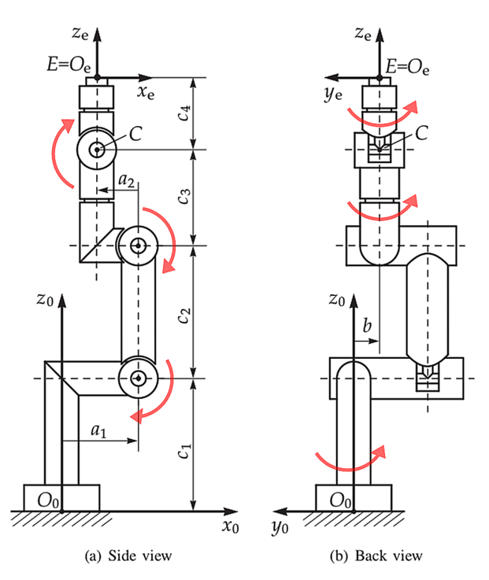

# How does it work?

You start from the convention that all z-axis point upwards in the robot's zero position. (Except for the `tool0` frame.)


From the urdf file follows the relative position of every frame and the direction of the joint axis relative to these frames. These are converted to absolute coordinates, all expressed in the `base_link` frame. In code this information is expressed as an `Axes` object. Each `Axes` has a `position` and a `direction`. The `direction` is a unit vector along the joint axis following the right hand rule for the sign of the rotation.

Now you can move from the base to the end-effector extracting the opw parameters. It's easier if we keep a picture at hand:



## a1 and c1

**a1** is the distance perpendicular between joint axis 1 and joint axis 2. It is signed, defined positive along the x-axis of the `base_link` frame. **c1** is the distance of the second joint axis above the base plane.

If we add the (strong) assumption that all joint axis are defined along one of the main coordinate axes, the the above calculation can be simplified. In addition, it turns out that in most robots, the second joint axis (`G2`) is defined along the global y-axis.

```python
params['a1'] = G2.position.x
params['c1'] = G2.position.y
```

# Assumptions

Assumptions for using opw kinematics model:
- 6 revolute joints
- Last three axes intersect.
- axis 1 and 2 perpendicular
- axis 2 and 3 paralell

ROS-Industrial conventions for urdf
- All z-axis point upwards in zero position (except tool frame).

Additional assumptions made for this plugin
- All joint axis defined along a main coordinate axis (in zero position).
- Second joint axis along global y-axis.